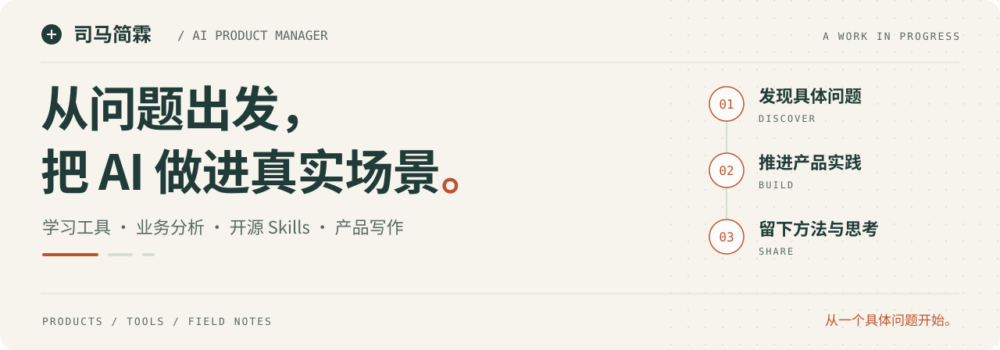

<picture>
  <source media="(prefers-color-scheme: dark)" srcset="assets/hero-dark.svg">
  <source media="(prefers-color-scheme: light)" srcset="assets/hero-light.svg">
  
</picture>

# 你好，我是司马简霖

**AI 产品经理，做产品，也写下做产品时的思考。**

我围绕学习辅助、业务数据分析和产品研究做项目，把实践中的方法整理成可复用的 Skills，也在公众号「司马简霖」记录 AI 产品与行业观察。

我关心一个功能能否帮用户完成具体的事：材料能不能变成下一次复习，数据能不能支撑一次判断，模型的输出能不能找到依据。

**[体验「笨」人学习](https://sr9rtrj3qbdm2junbffg4.apigateway-cn-beijing.volceapi.com/login)** · [查看开源作品](https://github.com/turetegeblocfaun-star?tab=repositories) · [阅读文章](#writing) · [邮件联系](mailto:xsp081024@163.com)

 

## 01 / 产品实践

### “笨”人学习

**AI 课后复习与查漏补缺平台 · 已上线，邀请制试点**

面向愿意投入、但缺少有效复习方法的学习者。把课后材料整理成笔记与知识结构，再通过引导式答疑、练习和错题复习，帮助用户找到下一步该学什么。

- **一条完整的学习路径**：材料整理 → 理解与练习 → 纠错 → 复习安排。
- **有依据的学习输出**：围绕用户选定的材料生成内容，保留来源，方便核对。
- **让用户参与思考**：Tutor 通过提问与提示引导理解，把学习过程留给用户。

[打开产品 ↗](https://sr9rtrj3qbdm2junbffg4.apigateway-cn-beijing.volceapi.com/login) · [阅读项目说明](projects/benren-learning.md)

当前需要邀请码；如想体验，可通过邮件联系我。

### 物联网 AI 数据分析

**从结算数据到可追溯的经营分析 · 产品方案阶段，尚未开发**

围绕收入、成本与利润分析设计工作流：从数据导入与校验，到多维筛选、图表和带依据的业务报告。

方案中最关键的取舍是：**用确定性规则计算指标，让 AI 解释已有结果**。可选的私域资料检索用于补充业务背景，并为解释提供引用。

[阅读方案摘要 ↗](projects/iot-data-analysis.md)

 

## 02 / 开源方法与工具

把反复用到的工作方法整理成 Skills，让下一次从更好的起点开始。

| 作品 | 用来做什么 |
| :--- | :--- |
| [**AI 产品经理 Skill**](https://github.com/turetegeblocfaun-star/peng-ai-product-manager-skill) | 从产品发现、PRD 到 AI 方案、评测与交付，组织产品全流程工作。 |
| [**AI 产品拆解 Skill**](https://github.com/turetegeblocfaun-star/peng-ai-product-teardown-skill) | 从真实页面与用户旅程出发，分析工作流、Agent 和产品架构。 |
| [**中文写作 Skill**](https://github.com/turetegeblocfaun-star/peng-chinese-writing-skill) | 共创选题、组织材料、写作与改稿，覆盖文章、教程、评测和口播等场景。 |
| [**专业笔记 Skill**](https://github.com/turetegeblocfaun-star/peng-professional-notes-skill) | 整理会议与课堂材料，提炼知识，衔接 Obsidian、Wiki 和 Canvas 等笔记形式。 |

### 产品拆解记录

[蚂蚁阿福：用户旅程与页面证据](https://github.com/turetegeblocfaun-star/antafu-product-teardown) · [LibTV：产品体验与可视化报告](https://github.com/turetegeblocfaun-star/libtv-product-teardown) · [蚂蚁阿福 × LibTV：AI 产品架构分析](https://github.com/turetegeblocfaun-star/antafu-libtv-ai-architecture-analysis)

 

## 03 / 写作与思考

**微信公众号：司马简霖**

写 AI 产品实践，也观察模型能力、商业模式与产品决策之间的关系。

| 文章 | 发表日期 |
| :--- | :--- |
| [苹果起诉 OpenAI 后，我更关心 GPT-6 的行动权](https://mp.weixin.qq.com/s/uNOVtQaBGcMbqoRy-hS7Mw) | 2026.09.05 |
| [硅谷重新开放模型，最强能力为什么仍要收费](https://mp.weixin.qq.com/s/VJiEW_jfjMac20mRCtEfEw) | 2026.08.16 |
| [中国开放模型还没有全面领跑，硅谷为什么先坐不住了](https://mp.weixin.qq.com/s/CRdWickaN2U2WLh5ps3bRA) | 2026.08.15 |
| [零基础转 AI 产品经理，先把一个小问题做成产品](https://mp.weixin.qq.com/s/YmKSFQ5lK_v69Uvi1TnDTQ) | 2026.08.14 |

 

## 04 / 联系我

欢迎交流 AI 产品、学习工具、数据分析与 Skills，也欢迎带着具体问题一起讨论。

**[xsp081024@163.com](mailto:xsp081024@163.com)**

---

从一个具体问题开始，让每次实践留下可以继续改进的作品。
